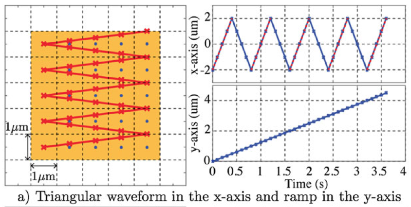

# Homemade scanning tunneling microscope

I am building a small scanning tunneling microscope (STM): a machine that uses a sharp metal tip and a tiny electric current to map a conductive surface.


## Where the project is at

The hardware has not been assembled yet. This repo has the desktop app, the parts list, and the circuit references for the build.

## How it works

The tip is brought very close to a conductive sample without touching it. At that distance, a very small current can cross the gap. The STM measures that current while moving the tip across the sample.

There are two ways to scan:

- **Constant height:** keep the tip at one height and record how the current changes.
- **Constant current:** change the tip height to keep the current steady, then use those height changes as the surface map.

## The main pieces

- An ESP32 sends commands and reads the measured current.
- The piezo driver moves the tip in X, Y, and Z.
- The preamplifier turns the tiny tunneling current into a voltage the controller can read.
- A kinematic mount, piezo disk, and sharp wire make the scan head.


The four piezo outputs combine X, Y, and Z into `Z+X`, `Z-X`, `Z+Y`, and `Z-Y`. That lets one piezo disk bend the tip sideways as well as move it up and down.


The preamplifier sits close to the tip. Its high-value feedback resistor is what makes very small currents measurable.

## Parts and cost

The listed build total is **$500.62**. Every item has a purchase link in [BOM.csv](BOM.csv). It covers the electronics, boards, mechanics, scanner head, batteries, and shielding material.

## Design files

- [Scan-stage CAD archive](STM.f3z) — open this Fusion 360 archive to see the `ScanStage` assembly.
- [Controller-board Gerbers](docs/pcb/Adapterboard-PTH.zip) — upload this archive to JLCPCB to make the controller board.
- [Tunneling-amplifier Gerbers](docs/pcb/Tunnelling-Amp.zip) — upload this archive to JLCPCB to make the preamplifier board.

## Build order

1. Assemble and test the controller board with low-voltage signals first.
2. Build the preamplifier, shield it, and confirm that it has a quiet output before connecting the tip.
3. Make the piezo scanner by dividing a 20 mm piezo disk into four quadrants and attaching the leads.
4. Mount the scanner and tip in the kinematic mount, then check that X, Y, and Z move in the expected directions.
5. Start with a conductive test sample and a very slow scan.

## Scanning pattern

The tip sweeps back and forth in X while the Y position steps upward after each line. Together, those movements make a raster scan.



## Desktop app

`stm_app.py` is a small desktop control app. It can set scan parameters, display a live image, save a scan, and send serial commands to the controller.

```bash
git clone https://github.com/UtkarshTewari24/STM.git
cd STM
python3 -m pip install numpy matplotlib pyserial
python3 stm_app.py
```

The app needs the matching controller firmware and connected STM hardware before it can scan.

## Files

- `BOM.csv` — parts, quantities, prices, and purchase links.
- `stm_app.py` — desktop scan-control app.
- `docs/images/` — system drawing, circuit references, and raster-scan drawing.

## Safety

The analog electronics use positive and negative supply rails. Check wiring with power off, keep the preamplifier and tip clean, and use eye protection when cutting wire or piezo ceramic.
